# 📘 Bridge Inventory Training Manual

  
  
  
  

This document is written for end users of the web app: operations staff, purchasing teams, sales representatives, billing/finance personnel, supervisors, and onboarding team members.

> [!NOTE]
> **Operational Scope:**  
> This file is a step-by-step training guide, not a technical developer document. For codebase architectures, local server configurations, or migration steps, refer to [README.md](./README.md) and [docs/security/login-system.md](./docs/security/login-system.md).

---

## 1. What This System Does

This platform is custom-built to support a middle-man trading business model that buys products from suppliers, holds stock, and resells them to customers. The system maintains robust historical snapshotting so transaction audits stay clean even if catalog details change later.

The app coordinates and relates seven distinct workflows:
1.  **Master Catalog**: Products, nested categories, suppliers, and customers.
2.  **Quotations**: Customer quotes, stock checks, and purchase/sales generation.
3.  **Purchases**: Supplier orders, expected deliveries, and partial or full receiving logs.
4.  **Sales**: Outbound sales orders, item-level fulfillment, and automatic/manual FIFO allocations.
5.  **Finance Follow-up**: Customer receivables (Billing Notes), supplier payables (Payment Batches), and returns/cancel logs (Credit Notes).
6.  **Operational Review**: Dashboard, inventory control, AI Chat, and printable AI Reports.
7.  **Administration**: Login, role-based user access, permission-aware navigation, and activity logs.

---

## 2. Who Should Use Which Screen

| Role | Core Workspace Responsibilities |
| :--- | :--- |
| **Admin / Supervisor** | `Dashboard`, `Inventory`, `Settings` in the sidebar footer (Monitor margins, low stock, and system language) |
| **System Administrator** | `User Access`, `Activity Log` (Create users, assign roles, review activity history, and verify access) |
| **Product Controller** | `Products`, `Categories`, `Inventory` (Keep master catalogs and conversions accurate) |
| **Purchasing Staff** | `Quotation` (short-stock lines), `Purchases` (POs), `Suppliers` (Vendor records) |
| **Sales Representatives** | `Quotation` (Inbound deals), `Sales` (Order progression), `Customers` (Accounts) |
| **Finance Personnel** | `Billing Notes` (AR), `Payment Batches` (AP), `Credit Notes` (Returns/Cancellations) |

---

## 3. Sidebar Navigation

The sidebar navigation bar is grouped logically by business function:

*   **Workspace**: `Dashboard` (operational overview), `Inventory` (reorder planning, stock health, AP/AR snapshots), `AI Chat` (natural language queries), and `AI Report` (printable supplier/customer/product reports).
*   **Purchasing**: `Purchases` (receiving logs and PO history), `Payment Batches` (supplier payables).
*   **Sales**: `Quotation` (cost checks and conversion), `Sales` (order progress), `Billing Notes` (customer receivables), `Credit Notes` (returns/cancellations).
*   **Records**: `Products` (item setups), `Categories` (hierarchies), `Suppliers` (vendor records), `Customers` (customer records).
*   **Administration**: `User Access` and `Activity Log`, shown only to users with the required access.
*   **Sidebar footer**: `Settings` for language toggling between English and Thai, plus the `Sign Out` action.

  

*Sidebar navigation showing the Workspace, Purchasing, Sales, Records groups, plus footer settings and sign-out controls.*

The sidebar is permission-aware. If a logged-in user does not have access to a module, the navigation item is hidden. The backend remains the authority for permission checks when authentication enforcement is enabled.

---

### 3.1 Accessing the App: Sign In & Guest Mode

The system enforces modern secure access to protect transaction logs and supplier costs.

#### A. Secure Credentials Log In
1. Open the application URL in your browser.
2. Enter your assigned **Username** and **Password**.
3. **Remember Me**: Check this box if you are working on a trusted, private workstation. This stores your session tokens in `localStorage` so you remain logged in across browser restarts. Leave it unchecked on shared company terminals; the session will use browser `sessionStorage` instead.
4. **Language Toggle**: Select **English** or **ไทย** at the bottom of the card. The interface strings will instantly translate.
5. Click **Sign In**. The page will refresh and establish a live, authenticated link to the Django backend database.

#### B. Preview as Guest (Onboarding & Previews)
For trainee onboarding, quick walkthroughs, or system demonstrations without connecting to backend servers, click the **"Preview as Guest"** button. This bypasses credentials and starts a sandbox session loaded with pre-configured mock data.

> [!WARNING]
> **Guest Sandbox Session:**  
> Any transactions, products, or edits made in Guest Mode exist purely in memory on your browser and will not post back to the live company database. Always log in with credentials for live operations.

#### C. Safely Signing Out
1. Go to the bottom of the sidebar.
2. Verify your active username shown in the sidebar footer above the **Sign Out** button.
3. Click the **"Sign Out"** button (represented by the logout icon). The system will instantly delete all active tokens from storage, unmount the workspace, and reload back to the secure Sign In card.

---

## 4. Training Sequence For New Users

Train new staff and trainees in this exact progressive order:
1.  **Interface Basics**: Navigate sidebar categories and toggle languages.
2.  **Catalog Master**: Review categories and understand product base-unit setups.
3.  **Partners**: Inspect supplier pricing rules and customer shipping cards.
4.  **Quotes**: Build a quotation and inspect stock-sufficiency status flags.
5.  **Purchases**: Convert quotes to Purchase Orders and log partial/full physical receipts.
6.  **Sales**: Create a Sales Order, review FIFO allocations, and progress delivery flags.
7.  **Receivables**: Assemble Billing Notes for delivered, un-billed sales.
8.  **Payables**: Formulate Payment Batches for received, un-paid purchases.
9.  **Adjustments**: Log Credit Notes for returned or cancelled sales.
10. **Review**: Evaluate dashboard metrics, stock health, FIFO layers, AI Chat answers, and AI Reports.
11. **Administration**: For admin users, create staff accounts, assign roles, review role permissions, and check activity logs.

---

## 5. Before You Start Checklist

Before logging actual transactions, confirm that all of the following catalog master steps are checked off:

*   [ ] Nested **Categories** have been created in a single visual tree.
*   [ ] All active **Products** have unique, system-conforming SKUs.
*   [ ] Every product has its correct, un-editable **Base Unit** configured.
*   [ ] Default **Purchase Units** and **Sales Units** are correctly configured.
*   [ ] Proper **Unit Conversions** are logged for items bought/sold in different packages (e.g. Box of 10 to Single units).
*   [ ] **Suppliers** and **Customers** have active legal names and correct Tax IDs.

---

## 6. Core Rules Users Must Understand

> [!IMPORTANT]
> **The Five Commandments of Bridge Inventory:**
> 1.  **Stock is Not Free-Text**: Available stock numbers are derived exclusively from your transactional logs. You cannot manually override stock totals without record entries.
> 2.  **Purchase Receipts Increase Stock**: Available inventory levels only go up when line items in your Purchase Orders are progressed to the `Received` status.
> 3.  **Sales Decrements Stock**: Outbound deliveries reduce stock according to backend FIFO checks once sales progress beyond draft.
> 4.  **FIFO Allocation is Authoritative**: Older received stock is cleared first (First In, First Out). The app allocates layers automatically but allows manual override if a specific layer is physically moved.
> 5.  **Snapshot Logs Are Intentional**: Changing a product's name, cost, or supplier details in the master catalog will *never* corrupt or rewrite past historical invoices. Historical documents preserve a snapshot of the records at the exact time of the transaction for auditable record-keeping.
> 6.  **Access is Role-Based**: Staff should use accounts and roles that match their responsibilities. Hidden navigation is a convenience, but backend permissions are still the protection layer when authentication enforcement is enabled.

---

## 7. First-Time Master Data Setup

### 7.1 Categories
Use `Categories` to build a clean catalog hierarchy.
1. Navigate to **Categories** under the Records group.
2. Click **Create Category**.
3. Input the parent category or set as top-level.
4. Add nested subcategories (child rows) as required.

*   [ ] Hierarchy tree is organized logically.
*   [ ] No duplicate naming exists.
*   [ ] Subcategories are linked to the correct parent nodes.

  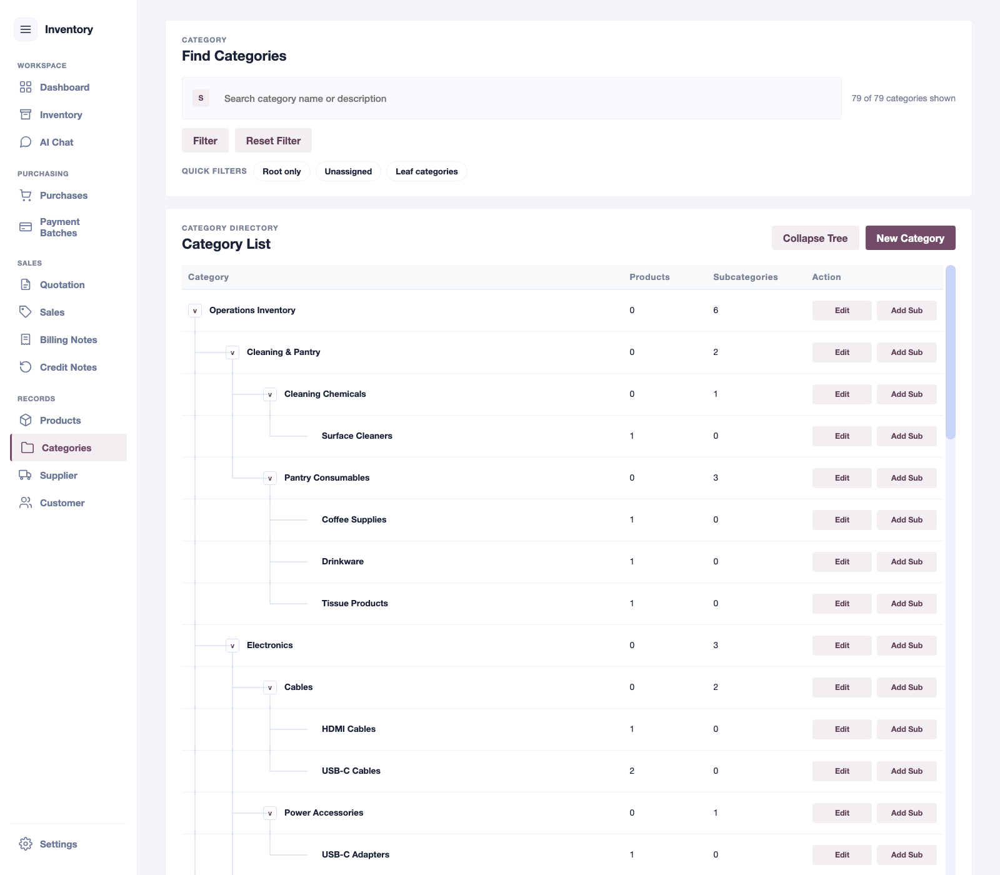

*Category tree showing visual parent and child rows.*

---

### 7.2 Products
Use `Products` to register new items in the master catalog.

> [!WARNING]
> **Base Unit Constraint:**  
> The **Base Unit** is the absolute smallest unit of stock measurement. Once a product is saved and used in transactions, its Base Unit is locked to protect historical stock records. Ensure this is correct before saving.

1. Navigate to **Products** and click **New Product**.
2. Input the unique **SKU** and **Product Name**.
3. Select its **Category**.
4. Configure the **Base Unit** (e.g., *pcs*).
5. Specify default **Purchase Units** (e.g., *box*) and **Sales Units** (e.g., *pcs*).
6. **Add Unit Conversions**: If a default purchase unit is a *box* of 12 *pcs*, set `1 box = 12 pcs`.
7. Configure its **Reorder Point** (the safety threshold for restocking notices).

*   [ ] SKU is unique.
*   [ ] Base, purchase, and sales units are correct.
*   [ ] Proper unit conversions are saved.

  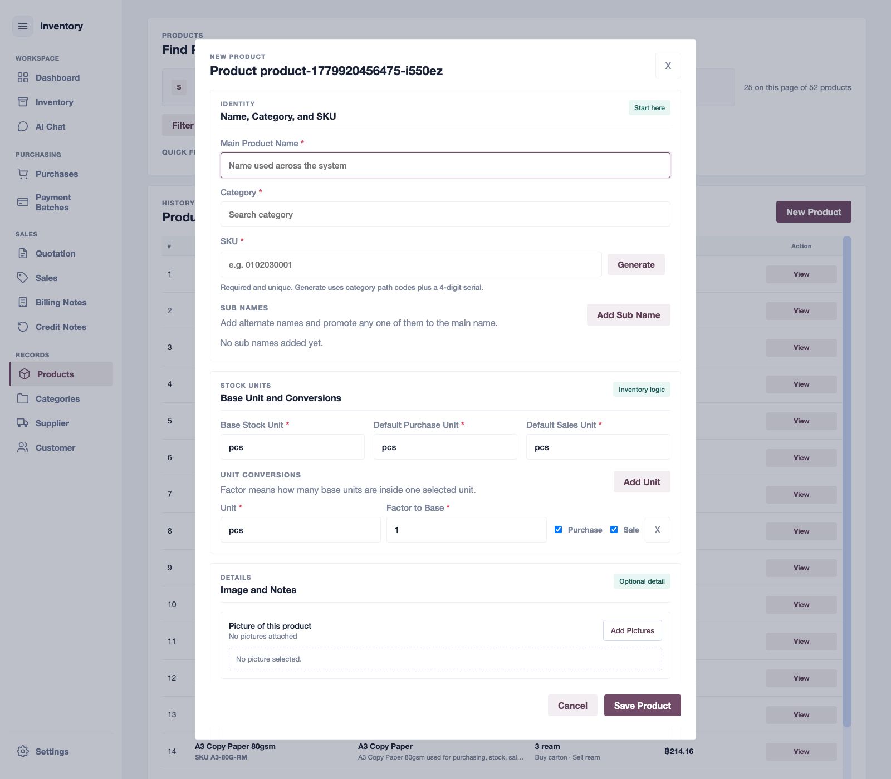

*Product form showing base unit, purchase/sales units, and conversion ratios.*

---

### 7.3 Suppliers
Use `Suppliers` to organize and list your vendor network.
1. Go to **Suppliers** and click **New Supplier**.
2. Register the **Company Name** and legal **Tax ID**.
3. Enter key **Procurement Contacts**, phone numbers, emails, and address terms.
4. Input default **Payment Terms** (e.g., credit terms or cash terms).

*   [ ] Legal company name is correct.
*   [ ] Payment terms and bank details are entered.

  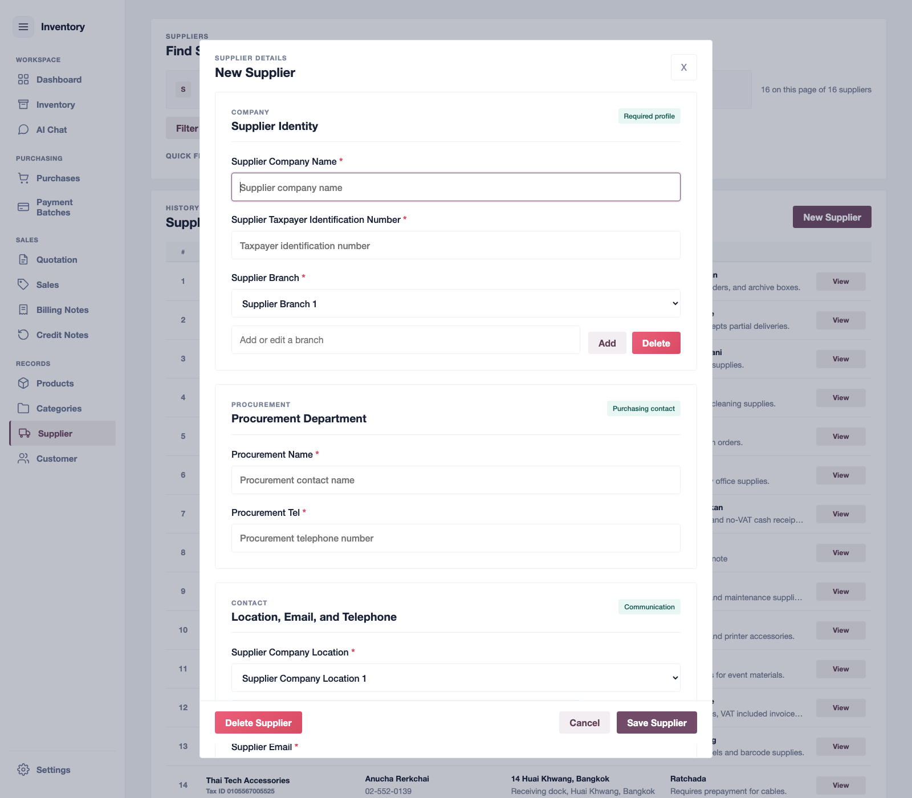

*Supplier setup card for contact and procurement details.*

---

### 7.4 Customers
Use `Customers` to organize client cards.
1. Navigate to **Customers** and select **New Customer**.
2. Provide the company name and billing/shipping addresses.
3. Record their official **Tax ID** for invoice tax filings.
4. Set default **Payment Terms** (e.g., Credit 30 days).

*   [ ] Billing details and Shipping addresses are correct.
*   [ ] Official Tax ID is logged.

  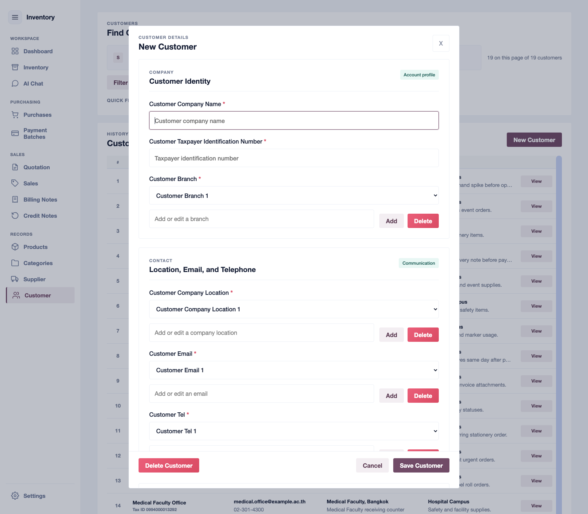

*Customer details setup card.*

---

## 8. Daily Workflow Training

### 8.1 Quotation Workflow
Quotations compare active stock levels against customer demand and capture vendor costs before any sales are committed.
1. Navigate to **Quotation** and select **New Quotation**.
2. Select the target **Customer**.
3. Add item lines, entering desired **Quantities** and **Sale Prices**.
4. Check the **Stock Sufficiency** status column:
   - **`Sufficient`**: You have enough available received stock in FIFO layers to cover this line immediately.
   - **`Need Purchase`**: Your available stock is short. You should restock this product before attempting delivery.
5. If stock is short, you can record a **Supplier Sourcing** option directly on the line to log estimated costs.
6. Click **Save Quotation**.

> [!TIP]
> **One-Click Conversions:**  
> Once a quote is saved, you can use the conversion action buttons to instantly generate a **Sales Order** (for sufficient items) or a **Purchase Order** (specifically targeting the short-stock items).

*   [ ] Customer and quantities are correct.
*   [ ] Sourcing costs and sale prices are verified.
*   [ ] Stock sufficiency signals have been reviewed.

  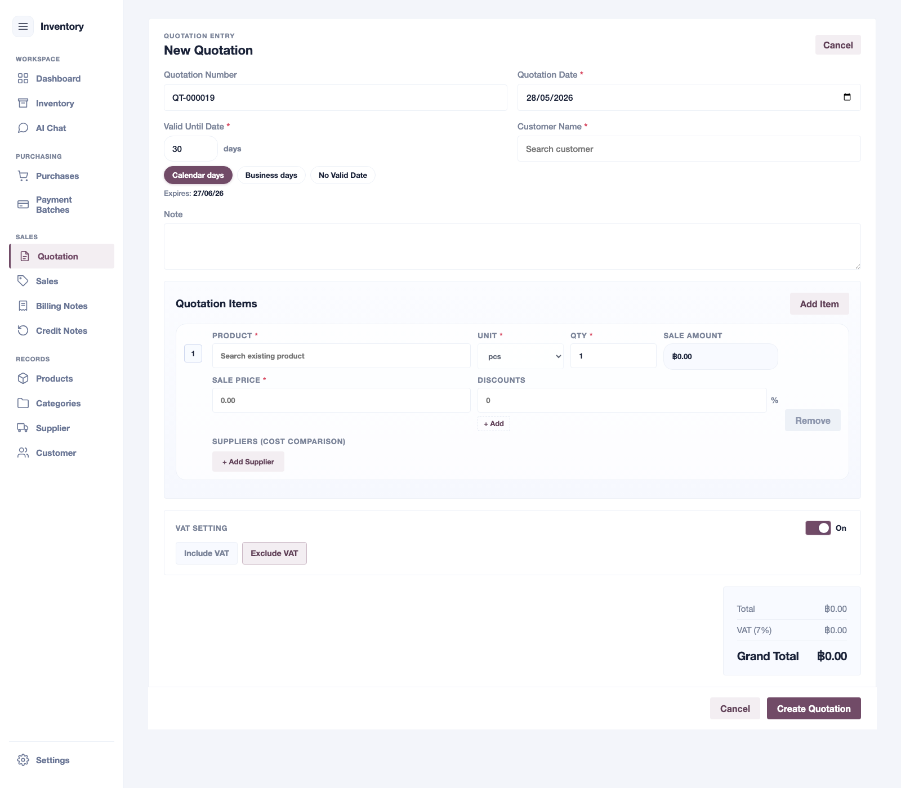

*Quotation entry panel with sufficiency checkers and sourcing options.*

---

### 8.2 Purchase Workflow
Purchase Orders (PO) contract your suppliers to restock inventory layers.
1. Go to **Purchases** and click **New Purchase**.
2. Select the **Supplier**.
3. Add item lines, confirming the **Quantity**, **Unit**, and **Unit Cost** negotiated.
4. Set the **Expected Delivery Date** for logistical tracking.
5. Click **Save Purchase** (registers as `ordered`).
6. **Log Receipts**: Once goods physically arrive at the warehouse, open the saved PO and progress each line item's receiving status. Available stock will dynamically adjust based on these logs.

> [!IMPORTANT]
> **Warehouse Verification:**  
> Never mark a purchase line item as `received` until the physical goods have been inspected and placed on your warehouse shelves. Marking them received immediately increases available stock for sales allocations.

*   [ ] Vendor details and item costs are correct.
*   [ ] Line-item receiving progress matches physical stock arrivals.

  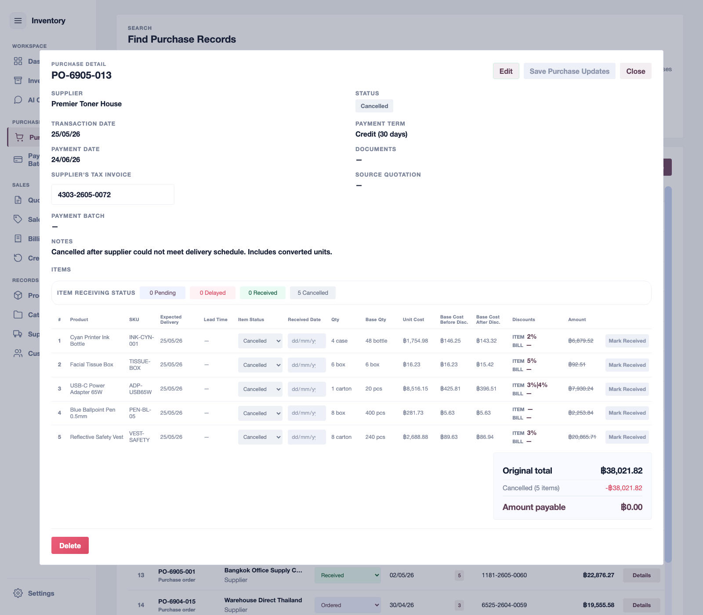

*Purchase detail panel with line-item receiving logs.*

---

### 8.3 Sales Workflow
Sales Orders fulfill customer demand and allocate stock using First-In, First-Out (FIFO) layers.
1. Go to **Sales** and select **New Sale**.
2. Select the **Customer**.
3. Add products, specifying quantities and unit prices.
4. **FIFO Allocation Mode**:
   - **Automatic FIFO**: The system automatically allocates stock starting from your oldest received purchase layer.
   - **Manual Selection**: Click to choose specific received purchase layers to deduct stock from (useful if specific batches were physically chosen).
5. Click **Save Sale**.
6. Progress lines through fulfillment stages: `packed` ➔ `shipped` ➔ `delivered` as operations occur.

> [!WARNING]
> **Fulfillment Integrity:**  
> Do not mark sale items as shipped or delivered just to clear them from your screen. These statuses trigger stock deductions and control downstream billing eligibility.

*   [ ] Customer account and quantities are correct.
*   [ ] Manual layer sources match physical shipments (if not using automatic FIFO).
*   [ ] Delivery progress statuses reflect actual operational events.

  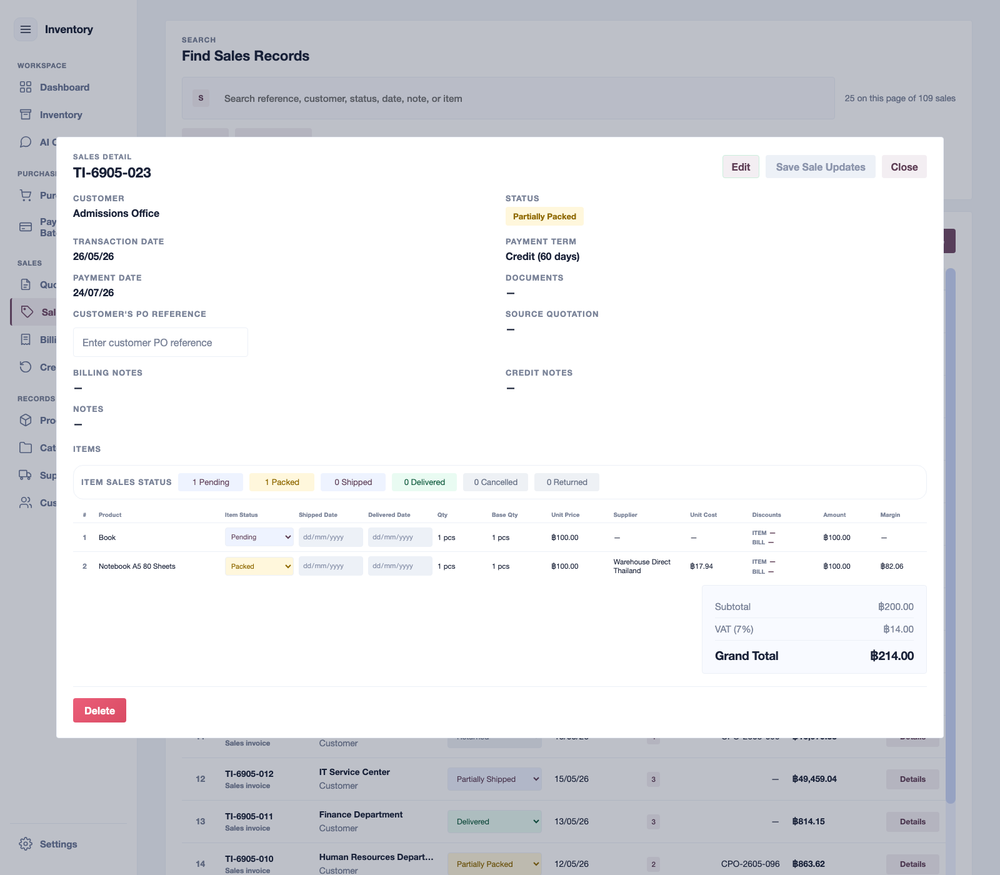

*Sales detail screen tracking delivery progress.*

---

### 8.4 Billing Note Workflow
Billing Notes collect customer receivables (AR) for completed shipments.
1. Navigate to **Billing Notes** and click **New Billing Note**.
2. Select the **Customer**.
3. **Select Eligible Sales**: Choose from the list of sales orders that are ready to bill.
   - *A sales order is eligible once it is shipped, partially delivered, or delivered, and is not already linked to another active billing note.*
4. Review customer billing parameters, due dates, and totals.
5. Click **Save Billing Note** (saves as `issued`).
6. When the payment arrives, click **Receive Payment**, enter the actual bank reference, and mark lines as fully received.

*   [ ] Selected sales belong to the correct customer.
*   [ ] Customer billing details and expected payment dates are verified.

  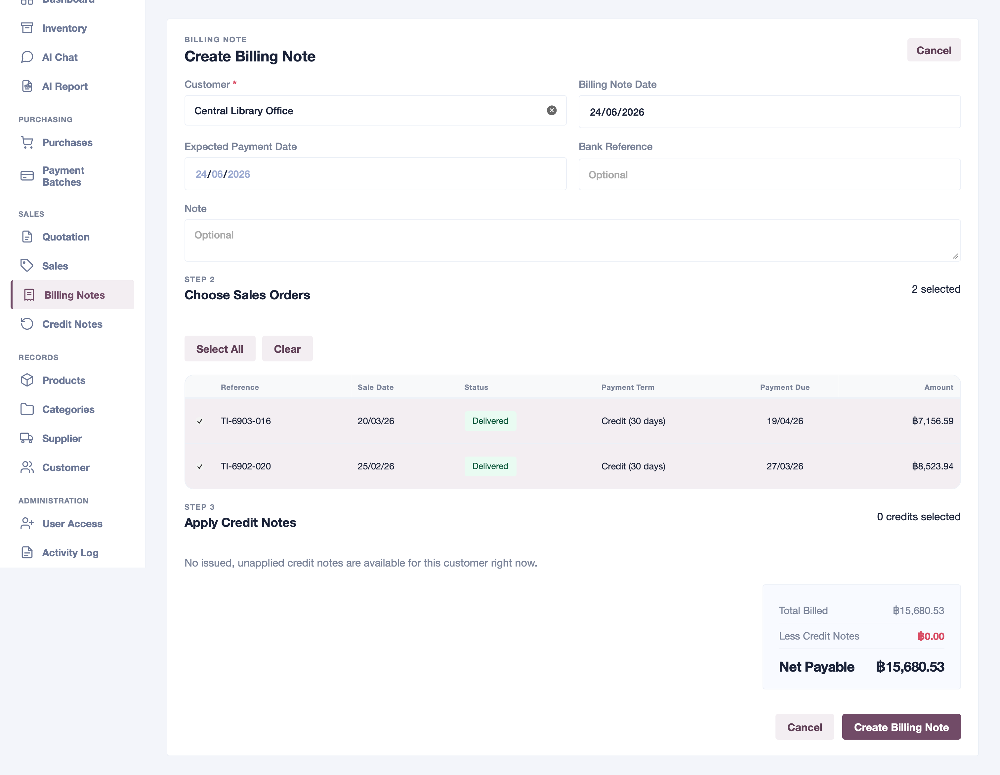

*Billing note creator displaying eligible customer sales.*

---

### 8.5 Payment Batch Workflow
Payment Batches manage supplier payables (AP) for received warehouse inventory.
1. Navigate to **Payment Batches** and click **New Payment Batch**.
2. Select the **Supplier**.
3. **Select Eligible Purchases**: Select from the list of ready POs.
   - *A purchase order is eligible once it has received inventory items and is not already included in another active payment batch.*
4. Review planned payment dates and totals.
5. Click **Save Payment Batch** (saves as `scheduled`).
6. Once the transfer is completed, click **Mark as Paid** and log the bank transaction number.

*   [ ] Supplier account and bank details are correct.
*   [ ] Total payable amount matches your bank transfer.

  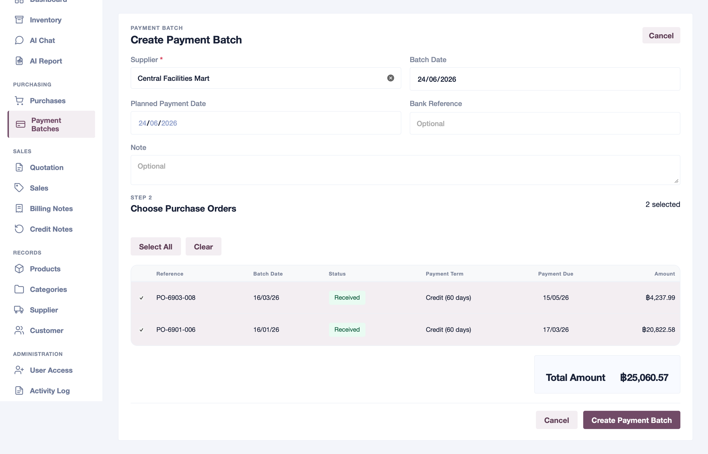

*Payment batch creation displaying eligible received purchases.*

---

### 8.6 Credit Note Workflow
Credit Notes record value reductions for returned or cancelled sales.
1. **Trigger from Sales**: In your **Sales** screen, change the status of an item to `cancelled` or `returned`.
2. **Review Auto-Prompt**: The system instantly displays a credit note prompt. Review the details.
3. Click **Create Credit Note** to issue the adjustment immediately.
4. If you choose **Create Later**, the items are stored as eligible lines and can be processed via the **Credit Notes** menu.
5. Review the adjustments and click **Save Credit Note** (saves as `issued`).

*   [ ] Affected sale line matches the returned/cancelled goods.
*   [ ] Credit values and tax adjustments are correct.

  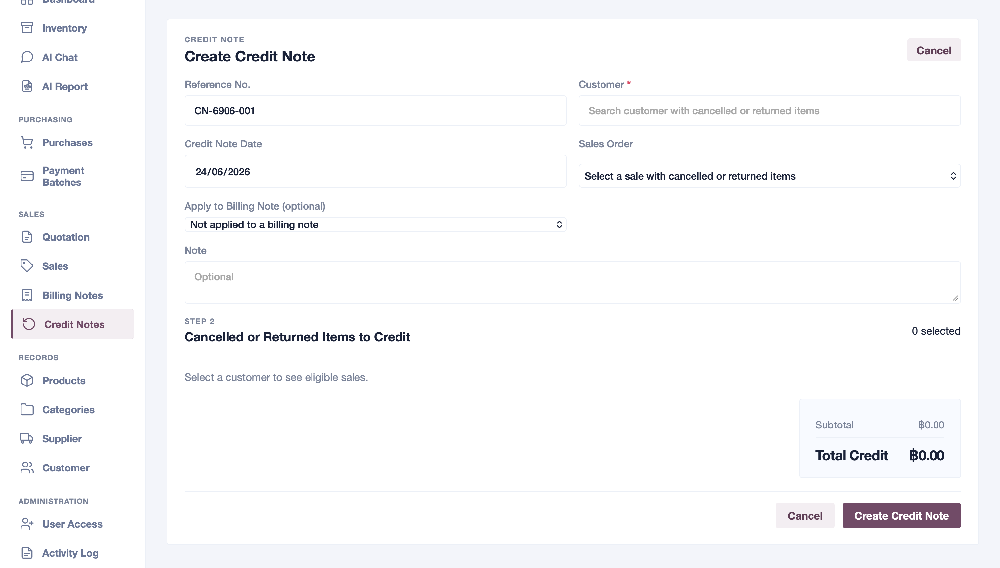

*Credit note setup panel from cancelled/returned goods.*

---

### 8.7 Printing Business Documents
Saved quotations, purchase orders, sales invoices, billing notes, payment batches, and credit notes can be printed in business-facing layouts.
1. Open the saved transaction from its history or detail modal.
2. Click **Print**.
3. A new browser tab opens with the printable document layout.
4. Use your browser's **Print** action in that tab to print or save as PDF.

> [!TIP]
> **What Gets Printed:**  
> Printed sales and quotations show customer-facing information. Printed purchases and payment batches show supplier-facing information. The print layout uses the saved transaction snapshot, so later edits to partner master data do not rewrite past documents.

---

## 9. Inventory Review Training

### 9.1 Dashboard
The **Dashboard** summarizes your company's operational position:
*   **Urgent Reorder**: Highlights products already at or below reorder level and lets you jump into a quick PO flow.
*   **Stock Cycling**: Separates high-cycle, long-cycle, and one-off products so you can judge whether stock is moving normally.
*   **Delivery Planning**: Surfaces open sales by fulfillment stage and flags delayed inbound stock affecting dispatch.
*   **Cash-Flow Forecast**: Compares near-term receivables and payables.
*   **Order Coverage**: Shows whether open customer demand is covered by on-hand stock, incoming stock, or still has a gap.

*   [ ] Review urgent reorder items before they stock out.
*   [ ] Check delayed inbound supply before promising delivery dates.
*   [ ] Compare open receivables and payables for near-term cash pressure.

  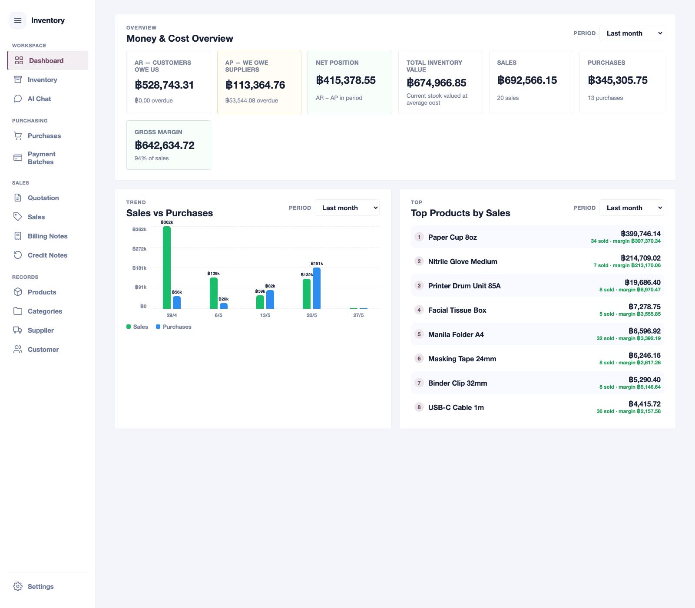

*Dashboard overview showing replenishment, delivery, cash-flow, and order-coverage signals.*

---

### 9.2 Inventory
The **Inventory** workspace is your primary control center for reorder planning:
*   **Control Board**: Separates stock-and-reorder KPIs from cash-position KPIs, including open AR, open AP, and net position.
*   **Formula Reference**: Explains how reorder point, safety stock, days left, and recommended buy quantities are calculated.
*   **Quick Filters**: Filter by health, movement, category, supplier, stockout window, reorder need, and stock value.
*   **Detail Modals**: Click any KPI or stock row to inspect the exact products, FIFO layers, and financial documents behind the number.

*   [ ] Review products flagged as low, watch, or dead stock.
*   [ ] Inspect suggested buy quantities and supplier options before raising POs.
*   [ ] Use the formula reference when validating reorder settings with supervisors.

  

*Inventory stock health and reorder console.*

---

### 9.3 Product History
When you need to audit a specific product's movements, open its history panel:
- Check current available, committed, received, and pending stock totals.
- Inspect every purchase entry that built your inventory, and every sales invoice that consumed it.

*   [ ] Verify stock matches your physical warehouse counts.
*   [ ] Inspect cost layer trends to check pricing health.

  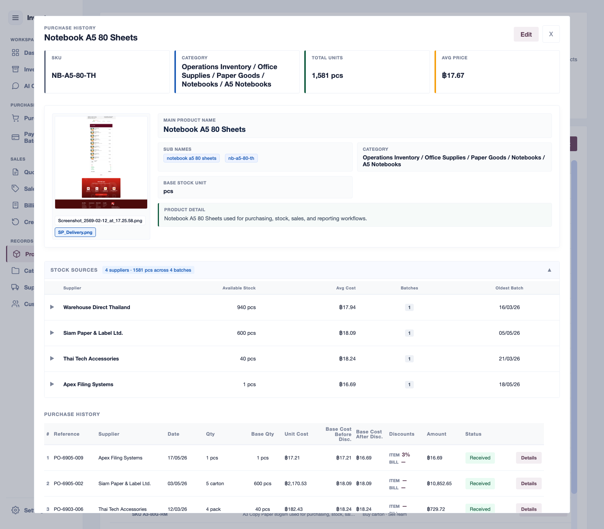

*Product audit view with cost history and transaction details.*

### 9.4 AI Chat
Use **AI Chat** for read-only operational questions. Good questions include low-stock checks, customer or supplier summaries, overdue issues, AP/AR status, order coverage, and line-item detail by document reference.

*   [ ] Ask only operational questions that match the supported inventory workflows.
*   [ ] Treat backend records and dashboard calculations as the source of truth.
*   [ ] Use AI Chat as a faster reading and summarizing tool, not as a record-editing tool.

### 9.5 AI Report
Use **AI Report** when you need a printable supplier, customer, or product report.

1. Open **AI Report**.
2. Select the report scope: **Supplier**, **Customer**, or **Product**.
3. Select the specific record.
4. Choose a custom period or use all-time reporting.
5. Click **Generate**.
6. Review the generated report in the new browser tab.
7. Use the report page's **Print** button to print or save as PDF.

The report includes backend-calculated metrics, chart rows, related records, and business analysis. If the AI API key is configured, AI can help write the analysis. If not, the system still creates a local report from the same backend data.

### 9.6 User Access and Activity Log
Use **User Access** to create user accounts, assign roles, activate or deactivate accounts, and manage role permissions. Use **Activity Log** to review login, create, update, and delete events.

*   [ ] Assign each user only the role needed for their responsibility.
*   [ ] Review administrator accounts before production use.
*   [ ] Check activity logs when investigating important record changes.

---

## 10. Daily End-To-End Example

Use this exercise during training sessions:
*   **Target Product**: `PVC Pipe 2m`
*   **Target Supplier**: `Alpha Plastics`
*   **Target Customer**: `North Build Co.`

#### Step-by-Step Training Walkthrough:
1. Confirm the product exists in **Products** with its base unit set to *pcs* and purchase unit set to *box* (`1 box = 10 pcs`).
2. Create a customer quote for `North Build Co.` requesting 15 *pcs*.
3. Review **Stock Sufficiency**—the system will show `Need Purchase` (since stock is 0).
4. Sourcing options: Select `Alpha Plastics` at a cost of `฿80` per *pc*.
5. Convert the short lines to a **Purchase Order** to `Alpha Plastics`. Note how the system converts the 15 *pcs* into 2 *boxes* based on your conversion rules!
6. Once the delivery arrives, open the PO, mark the items as `received` to add them to stock, and set the supplier invoice details.
7. Open **Sales** and convert the quote into a **Sales Order** for 15 *pcs*. Note how the system automatically allocates stock from the received PO layer!
8. Progress the Sales Order to `delivered`.
9. Navigate to **Billing Notes** and generate a customer invoice for `North Build Co.` for the delivered sale.
10. Navigate to **Payment Batches** and generate a vendor payment batch to pay `Alpha Plastics` for the PO.
11. **Log a return**: If the customer returns 1 *pc*, go to the Sales Order, change the item's status to `returned`, and issue the generated **Credit Note** immediately.

---

## 11. Common Mistakes To Avoid

> [!CAUTION]
> **Avoid These Five Costly Mistakes:**
> 1.  **Setting the Wrong Base Unit**: Saving a product with the wrong base unit will corrupt your downstream stock calculations. Verify this before saving.
> 2.  **Skipping Unit Conversions**: Selling in individual units but buying in cases without setting conversions will distort your inventory levels.
> 3.  **Premature Receipt Logs**: Marking PO items as received before they physically arrive makes stock appear available for sales allocation that doesn't actually exist.
> 4.  **Premature Delivery Logs**: Moving sales to shipped/delivered before physical dispatch distorts your FIFO cost allocations.
> 5.  **Re-keying Historical Fields**: Attempting to alter catalog variables directly on transaction lines instead of master records can lead to inconsistent historical logs.

---

## 12. Quick Reference Guide

| Goal | Navigate to... | Key Actions |
| :--- | :--- | :--- |
| **Check overall company margins** | `Dashboard` | Monitor AP/AR cash positions |
| **Plan restocks / restock calculations** | `Inventory` | Inspect reorder signals and FIFO layers |
| **Manage catalog products** | `Products` | Set SKUs, base units, and conversions |
| **Manage product categories** | `Categories` | Organise parent/child trees |
| **Manage vendor catalog costs** | `Suppliers` | Update credit terms and Tax IDs |
| **Manage customer accounts** | `Customers` | Log billing/shipping locations |
| **Provide a sales quote** | `Quotation` | Check live stock sufficiency |
| **Order from suppliers** | `Purchases` | Progress line-item receiving statuses |
| **Fulfill customer orders** | `Sales` | Progress delivery statuses (automatic/manual FIFO) |
| **Collect customer payments** | `Billing Notes` | Group eligible un-billed sales |
| **Settle supplier bills** | `Payment Batches` | Group eligible un-paid purchases |
| **Record returned goods** | `Credit Notes` | Issue adjustments from cancelled/returned sales |
| **Ask questions in plain text** | `AI Chat` | Query stock, customer/supplier summaries, overdue issues, AP/AR status, and line-item detail |
| **Generate printable analysis** | `AI Report` | Create supplier, customer, or product reports for a selected period |
| **Manage staff access** | `User Access` | Create users, assign roles, and manage role permissions |
| **Review system activity** | `Activity Log` | Check login/create/update/delete events |
| **Toggle language** | `Settings` in the sidebar footer | Change system language (English / Thai) |

---

## 13. Screenshot Capture Plan

When exporting this training manual to a PDF or handout, replace the placeholder images under these matching sections:
*   [ ] Section 3: Sidebar Navigation
*   [ ] Section 7.1: Category Tree
*   [ ] Section 7.2: Product Form with Unit Conversions
*   [ ] Section 7.3: Supplier Form
*   [ ] Section 7.4: Customer Form
*   [ ] Section 8.1: Quotation Entry Screen
*   [ ] Section 8.2: Purchase Form and Receiving Status
*   [ ] Section 8.3: Sales Form and Delivery Statuses
*   [ ] Section 8.4: Billing Note Eligible Sales Selector
*   [ ] Section 8.5: Payment Batch Eligible Purchases Selector
*   [ ] Section 8.6: Credit Note Eligible Sales Selector
*   [ ] Section 9.1: Dashboard Overview
*   [ ] Section 9.2: Inventory Stock Review Table
*   [ ] Section 9.3: Product History View
*   [ ] Section 9.4: AI Chat
*   [ ] Section 9.5: AI Report
*   [ ] Section 9.6: User Access and Activity Log

---

## 14. Notes For Future Maintainers

This training manual is an end-user guide. Keep it strictly aligned with real UI labels, translation dictionaries, and logical workflow behavior in the repository.

Before modifying operational workflow steps, verify changes against:
*   [README.md](./README.md)
*   [AGENTS.md](./AGENTS.md)
*   The actual page layouts and labels in `frontend/src`
