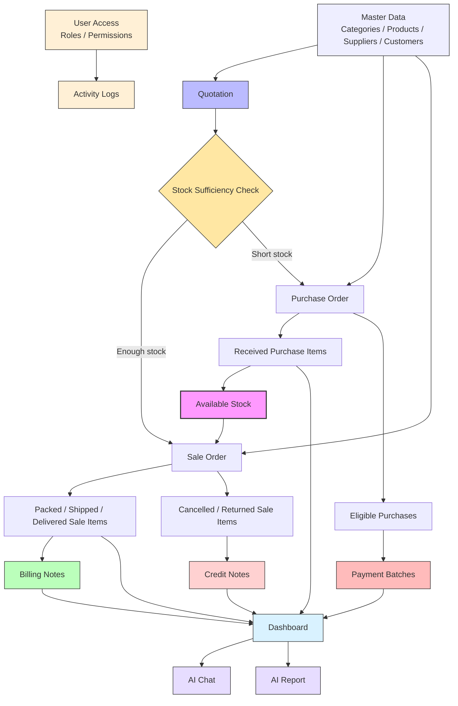

# Bridge Inventory

<p align="left">
  
  
  
  
  
  
</p>

Bridge Inventory is a full-stack, enterprise-lite inventory management system tailored for SME trading businesses. It is built specifically for **middle-man business models** that buy from suppliers, hold stock, and resell to customers. 

Instead of a generic stock tracker, this platform coordinates actual day-to-day operations: **Quotations, Purchases, Sales, Billing Notes, Payment Batches, Credit Notes, inventory control, AI Chat, AI Reports, user access, and activity logs**--all unified under authoritative backend calculations.

---

## Preview The App

Want to explore the user interface without running any local databases? 

**Explore the Live Demo:** [bridge-inventory.netlify.app](https://bridge-inventory.netlify.app)

> [!TIP]
> **To Preview the App:**  
> When the login page appears, simply click the secondary **"Preview as Guest"** button to instantly bypass credentials and explore the full app with pre-loaded mock datasets.

*This preview is a frontend-only deployment, perfect for exploring the interface, navigation, and offline mock-data flows.*

---

## Feature Snapshot

| Functional Area | Implemented Operational Capabilities |
| :--- | :--- |
| **Products & Stock** | Product master setups, nested categories, image/PDF product attachments, supplier-specific sourcing options, unit conversions, on-demand FIFO stock history, and an inventory control workspace for reorder planning. |
| **Quotations** | Customer billing quotes with unit-aware quantities, live stock-sufficiency indicators, and one-click conversion into sales orders or purchase lines. |
| **Purchases** | Detailed PO setups, partial/full receiving updates, expected arrival schedules, supplier tax invoice tracking, base quantity normalization, and cost snapshotting. |
| **Sales** | Stock-aware sales validation, live delivery trackers, cancelled/returned flows, average cost references, and transaction-locked automatic/manual FIFO purchase layer allocation. |
| **Finance (BN / PB / CN)** | Billing Notes for receivables, Payment Batches for payables, and Credit Notes for cancelled/returned goods, with server-validated transaction eligibility checks and net-of-credit billing summaries. |
| **Business Documents** | Printable quotation, purchase order, sales invoice, billing note, payment batch, and credit note layouts generated from shared transaction document configs. |
| **AI Assistant** | OpenAI-powered bilingual natural language query assistant focused on stock and fulfillment, partner summaries, receivables/payables with exceptions, and reference line-item detail. |
| **AI Reports** | Printable supplier, customer, and product reports with backend-calculated metrics, charts, record tables, AI-written analysis when configured, and local fallback when not configured. |
| **User Access & Audit** | Simple JWT login, refresh tokens, remember-me/session token storage, user profile lookup, role-based navigation, administrator user/role management, Django model permissions, and activity logs for login/create/update/delete events. |

---

## Why This Project Exists

Most free inventory tools handle only one slice of the business: simple ledger tracking, simple invoicing, or basic purchasing. In the real world, **these workflows must be integrated relational cycles**:



---

## Technology Stack

*   **Frontend**: React 18, Vite 7.3, Vanilla CSS custom design tokens (4px square system)
*   **Backend**: Django 5.x, Django REST Framework 3.x, JWT-based security (Simple JWT), Django groups/permissions, and activity logging
*   **Database**: MySQL (relational 3NF with audit-friendly historical snapshots)
*   **Core Concepts**: Relational master records, derived FIFO layers with row-locked sale allocation, opt-in backend pagination, lookup endpoints, permission-aware navigation, AI report context building, and bilingual context dictionaries.

---

## Repository Structure

```text
├── frontend/         # React + Vite single-page application
├── backend/          # Django + DRF REST API
├── docs/             # Extended reference files for maintainers and users
│   ├── ai/           # AI Chat and AI Report guides
│   ├── architecture/ # Source tree, schema, and frontend refactor references
│   ├── business/     # Workflow and business-rule references
│   ├── security/     # JWT login, roles, permissions, and activity logs
│   └── testing/      # Test plans and validation reports
├── blackbook/        # Report and user-evaluation supporting materials
└── AGENTS.md         # Engineering standards and constraints for contributors
```

---

## Documentation Reference

For deeper codebase context and engineering rules, check out the specialized guides:
*   [HANDOUT.md](./HANDOUT.md) — End-user training manual and user workflows.
*   [docs/ai/ai-assistant-guide.md](./docs/ai/ai-assistant-guide.md) — Supported AI assistant question types, limits, and usage examples.
*   [docs/ai/ai-assistant-how-it-works.md](./docs/ai/ai-assistant-how-it-works.md) — Plain-language developer explainer for how the assistant works behind the scenes.
*   [docs/business/workflow-reference.md](./docs/business/workflow-reference.md) — End-to-end workflow text for diagrams, presentations, and onboarding.
*   [docs/business/business-rules-reference.md](./docs/business/business-rules-reference.md) — Master business logic for exact status, FIFO, and eligibility behaviors.
*   [docs/architecture/codebase-structure.md](./docs/architecture/codebase-structure.md) — Navigation maps for the source tree and modular splits.
*   [docs/architecture/frontend-refactor-handoff.md](./docs/architecture/frontend-refactor-handoff.md) — Frontend split structures and state hooks details.
*   [docs/security/login-system.md](./docs/security/login-system.md) — Comprehensive guide on JWT login, guest mode, user access, roles, permissions, activity logs, and frontend 401 retry behavior.
*   [docs/architecture/database-schema.md](./docs/architecture/database-schema.md) — Full relational MySQL database tables, fields, ERD, and constraints.

---

## Local Quick Start

### Option A: Docker Setup

Use Docker when you want the easiest handoff to another developer or evaluator. This starts MySQL, Django, and Vite together with the same development defaults used by the local setup.

Prerequisites:

- Docker Desktop, or Docker Engine with Docker Compose

Start the full stack:

```bash
docker compose up --build
```

The backend container runs migrations automatically before starting Django. Once the services are ready:

- Frontend: [http://127.0.0.1:5173/](http://127.0.0.1:5173/)
- Backend API: [http://127.0.0.1:8000/api/](http://127.0.0.1:8000/api/)
- Django admin: [http://127.0.0.1:8000/admin/](http://127.0.0.1:8000/admin/)

Seed demo operational data:

```bash
docker compose exec backend python manage.py seed_operational_data
```

Create an admin user:

```bash
docker compose exec backend python manage.py createsuperuser
```

Stop the stack:

```bash
docker compose down
```

Reset the Docker database volume and start fresh:

```bash
docker compose down -v
docker compose up --build
```

The Docker setup stores MySQL data in a named `mysql_data` volume and mounts `backend/` and `frontend/` into their containers for development. Optional AI configuration can be passed through your shell environment:

```bash
OPENAI_API_KEY=your-key docker compose up --build
```

### Option B: Manual Local Setup

### 1. Backend Setup

Read the comprehensive backend instructions in [backend/README.md](backend/README.md).

> [!IMPORTANT]
> Create your MySQL database and user before running migrations. The default backend `.env` expects:
> ```env
> MYSQL_DATABASE=inventory_db
> MYSQL_USER=inventory_user
> MYSQL_PASSWORD=inventory_password
> MYSQL_HOST=127.0.0.1
> MYSQL_PORT=3306
> ```

Run the setup commands in your terminal:
```bash
cd backend
python3 -m venv .venv
source .venv/bin/activate
pip install -r requirements.txt
cp .env.example .env
python manage.py migrate
python manage.py runserver 127.0.0.1:8000
```

### 2. Frontend Setup

In a new terminal window:
```bash
cd frontend
npm install
npm run dev -- --host 127.0.0.1
```

Once both servers are running, access the local system at [http://127.0.0.1:5173/](http://127.0.0.1:5173/).

---

## Key Configuration Options

Backend configurations live in `backend/.env`. Important operational switches:
*   `INVENTORY_REQUIRE_AUTH`: Set to `True` to enforce global API JWT validation (all unauthenticated calls will be rejected with `401 Unauthorized`). Defaults to `False` for easy guest development.
*   `CORS_ALLOWED_ORIGINS`: Allowed frontends (defaults to local Vite URLs).
*   `OPENAI_API_KEY` & `OPENAI_MODEL`: Optional credentials for AI Chat and AI Report analysis.

---

## Useful Commands

### Running Project Verification
```bash
# Backend checks & unit tests
backend/.venv/bin/python backend/manage.py check
backend/.venv/bin/python backend/manage.py makemigrations --check --dry-run
backend/.venv/bin/python backend/manage.py test inventory

# Frontend build & audit
cd frontend && npm run build && npm audit --audit-level=moderate
```

### Data Seeding & Operations
```bash
# Seed realistic, balanced business records
backend/.venv/bin/python backend/manage.py seed_operational_data

# Clear transactions while preserving catalog master data
backend/.venv/bin/python backend/manage.py clear_operational_data

# Wipe EVERYTHING (Operational + master catalog data)
backend/.venv/bin/python backend/manage.py clear_operational_data --include-master-data
```

---

## Contributing & Extension Rules

If you adopt this repository to learn or to construct your own custom ERP program, please read [AGENTS.md](AGENTS.md) carefully.

> [!WARNING]
> **Critical Codebase Commitments:**
> 1.  **Keep it Relational**: Use MySQL migration schemas. Prefer Relational/3NF links for master catalog variables over large ad-hoc JSON blobs.
> 2.  **Audit Snapshots**: Never remove historical snapshot variables (e.g. `supplier_name`, prices, SKUs) from transaction tables—these act as durable financial logs even if master objects are edited.
> 3.  **No Monoliths**: Preserve the split components architecture. Put business rules in named helpers or hooks rather than growing large view files.
> 4.  **Stay Bilingual (Optional for Self-Extensions)**: By default, the app supports English and Thai through the `t()` helper. If you are extending the app for your own private use or business, maintaining the bilingual dictionary is not strictly required.
