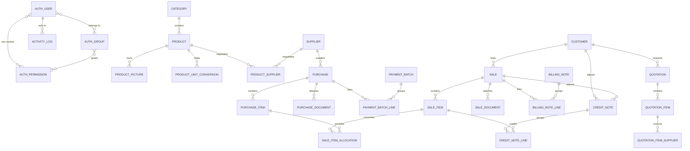

# Database Schema & Models Reference

  
  
  
  

This document serves as the permanent relational schema reference for the **Bridge Inventory** MySQL database structure, including the Django authentication tables used by the current login, role, and activity-log system.

---

## 1. Entity-Relationship Diagram (ERD)

The following diagram illustrates how Master Data, Transactional Operations, and Finance/Receivables tables relate via Foreign Key (FK) constraints:

---

## 2. Authentication, Roles, and Audit Tables

Bridge Inventory uses Django’s built-in authentication tables for identity and authorization, plus one inventory-owned audit table.

### 2.1 User (`auth_user`)
Primary account table managed by Django authentication.

Important fields used by Bridge Inventory:

*   `id` (BigAutoField, PK): Django user primary key.
*   `username` (CharField, unique): Login identity used by the current JWT flow.
*   `password` (CharField): Django password hash. Raw passwords are never stored.
*   `email` / `first_name` / `last_name`: User profile fields returned by `/api/auth/me/`.
*   `is_active` (BooleanField): Determines whether the account can sign in.
*   `is_staff` (BooleanField): Grants staff/admin-style access.
*   `is_superuser` (BooleanField): Global unrestricted Django permission bypass.
*   `last_login` / `date_joined`: Operational audit timestamps.

Bridge Inventory uses this table for:

*   JWT login
*   current-user profile lookup
*   admin user management
*   activity-log actor linkage

### 2.2 Group (`auth_group`)
Role container table used as the app’s role-management layer.

*   `id` (AutoField, PK)
*   `name` (CharField, unique): Role name shown in the app

Current default seeded groups:

*   `Admin`
*   `Manager`
*   `Sales`
*   `Purchasing`
*   `Accounting`
*   `Viewer`

These groups are created automatically if missing by [backend/inventory/access_control.py](../../backend/inventory/access_control.py).

### 2.3 Permission (`auth_permission`)
Standard Django permission table.

Bridge Inventory uses model-level permissions such as:

*   `view_product`
*   `add_purchase`
*   `change_sale`
*   `delete_customer`
*   `view_activitylog`
*   `view_user`
*   `change_user`

Permissions are attached either:

*   directly to users through Django’s `user_permissions` M2M table
*   indirectly through groups using Django’s `auth_group_permissions` M2M table

### 2.4 Activity Log (`ActivityLog`)
Append-only audit-style table owned by the `inventory` app.

*   `id` (CharField, 80, PK): Prefixed UUID string (`activity-xxxxxxxxxxxx`).
*   `user` (ForeignKey, `AUTH_USER`, `on_delete=models.SET_NULL`, nullable): Actor relationship when the user record still exists.
*   `actor_username` (CharField, 150): Username snapshot preserved even if the user is later changed or removed.
*   `action` (CharField, 40): `create`, `update`, `delete`, `login`.
*   `object_type` (CharField, 120): Django model label such as `inventory.Product` or `auth.User`.
*   `object_id` (CharField, 120): String snapshot of the affected record primary key.
*   `object_repr` (CharField, 255): Human-readable object snapshot.
*   `summary` (TextField): Ready-to-display audit summary.
*   `changes` (JSONField): Field-level `before` / `after` deltas for non-sensitive values.
*   `ip_address` (GenericIPAddressField, nullable): Client IP snapshot.
*   `user_agent` (CharField, 255): Request user-agent snapshot.
*   `created_at` (DateTimeField): Audit event timestamp.
*   *Indexes*: `[user, created_at]`, `[action, created_at]`, `[object_type, created_at]`.

The table currently records:

*   successful login
*   create/update/delete via inventory DRF model viewsets
*   create/update/delete of admin-managed users
*   create/update/delete of admin-managed roles

Sensitive-looking fields such as password or token fields are deliberately excluded from the stored change payload.

---

## 3. Master Data Tables

### 3.1 Category (`Category`)
Defines the hierarchical nested tree structure for products.
*   `id` (CharField, 80, PK): Prefixed UUID string (`category-xxxxxxxxxxxx`).
*   `name` (CharField, 255): Category display name.
*   `description` (TextField): Descriptive notes.
*   `parent` (ForeignKey, `self`, `on_delete=models.PROTECT`, nullable): Recursive self-link establishing tree relations.

---

### 3.2 Supplier (`Supplier`)
Represents the supplier vendor profile cards (inherits from `BusinessPartner`).
*   `id` (CharField, 80, PK): Prefixed UUID string (`supplier-xxxxxxxxxxxx`).
*   `company_name` (CharField, 255): Official vendor legal name.
*   `procurement_name` (CharField, 255): Primary purchase agent contact name.
*   `procurement_tel` (CharField, 80): Agent direct contact number.
*   `taxpayer_id` (CharField, 64): Legal corporate Tax ID for invoice filing.
*   `locations` / `emails` / `tels` / `branches` / `shipping_addresses` (JSONField): Multi-value partner profile lists.
*   `selected_location_index` / `selected_email_index` / `selected_tel_index` / `selected_branch_index` / `selected_shipping_address_index` (PositiveIntegerField): Preferred print/display selections.
*   `remark` (TextField): Internal notes.
*   `term_type` (CharField, 20): Default payment term keyword — `"credit"` or `"cash"` (displayed as "Cash" / "เงินสด").
*   `billing_note_date` (CharField, 40): Default customer-facing billing date preference string shared through the partner base model.
*   *Indexes*: Indexed by `company_name` and `taxpayer_id` for fast directory searches.

---

### 3.3 Customer (`Customer`)
Organizes corporate client registries (inherits from `BusinessPartner`).
*   `id` (CharField, 80, PK): Prefixed UUID string (`customer-xxxxxxxxxxxx`).
*   `company_name` (CharField, 255): Client corporate trade name.
*   `taxpayer_id` (CharField, 64): Corporate Tax ID for invoicing audits.
*   `locations` / `emails` / `tels` / `branches` / `shipping_addresses` (JSONField): Billing, shipping, and contact registries.
*   `selected_location_index` / `selected_email_index` / `selected_tel_index` / `selected_branch_index` / `selected_shipping_address_index` (PositiveIntegerField): Preferred print/display selections.
*   `remark` (TextField): Internal notes.
*   `term_type` (CharField, 20): Payment credit rules.
*   `billing_note_date` (CharField, 40): Default billing-note timing preference string.
*   *Indexes*: Indexed by `company_name` and `taxpayer_id`.

---

### 3.4 Product (`Product`)
Core catalog listing for inventory records.
*   `id` (CharField, 80, PK): Prefixed UUID string (`product-xxxxxxxxxxxx`).
*   `product_display_id` (PositiveIntegerField): Readable product sequential ID (defaults from `1001`).
*   `sku` (CharField, 80, Unique): Product stock keeping unit.
*   `previous_skus` / `sub_names` (JSONField): Alternate SKU history and sub-name aliases.
*   `product_name` (CharField, 255): Primary product display title.
*   `stock_base_unit` (CharField, 40, default "pcs"): Smallest indivisible warehouse unit.
*   `default_purchase_unit` / `default_sales_unit` (CharField, 40): Standard operational units.
*   `category` (ForeignKey, `Category`, `on_delete=models.SET_NULL`, nullable): Category classification.
*   `category_name` (CharField, 255): Denormalized category snapshot for fast list rendering.
*   `detail` (TextField): Product description / remarks.
*   `reorder_level` (DecimalField, 12,3): Stock reorder threshold.
*   `is_active` (BooleanField, default True): Set to False to disable the product without breaking history.
*   *Indexes*: Composited index on `[product_display_id, product_name]`, `[is_active, product_name]`, and independent indices on product search strings.

---

### 3.5 Supplementary Product Tables
*   **ProductPicture (`ProductPicture`)**:
    *   `product` (ForeignKey, `Product`, `on_delete=models.CASCADE`): Image owner.
    *   `file` (FileField, nullable): Legacy uploaded path under `products/pictures/`.
    *   `content` (BinaryField, nullable): Current DB-stored image/PDF bytes, used so attachments survive ephemeral deployment disks.
    *   `content_type` (CharField, 100): MIME type used when serving the attachment.
    *   `filename` (CharField, 255): Original display/download filename.
    *   `is_selected` (BooleanField): Primary thumbnail toggle.
*   **ProductUnitConversion (`ProductUnitConversion`)**:
    *   `product` (ForeignKey, `Product`, `on_delete=models.CASCADE`): Product context.
    *   `unit` (CharField, 40): Operational package unit (e.g. *box*).
    *   `factor_to_base` (DecimalField, 12,6): Conversion multiplier (`1 box = 12 pcs`).
    *   `allow_purchase` / `allow_sale` (BooleanField): Whether the unit is selectable for purchasing or selling flows.
    *   *Constraints*: Unique composite constraint on `(product, unit)`.
*   **ProductSupplier (`ProductSupplier`)**:
    *   `product` (ForeignKey, `Product`, `on_delete=models.CASCADE`)
    *   `supplier` (ForeignKey, `Supplier`, `on_delete=models.CASCADE`)
    *   `supplier_sku` (CharField, 80): Vendor SKU reference.
    *   `default_purchase_unit` (CharField, 40): Preferred purchasing unit for that supplier.
    *   `default_unit_cost` (DecimalField, 14,2): Pre-negotiated catalog cost.
    *   `lead_time_days` / `min_order_qty` (numeric fields): Supplier lead time and minimum-order defaults.
    *   `is_preferred` / `is_active` (BooleanField): Preferred sourcing toggle and active-state flag.

---

## 4. Transaction & Operations Tables

### 4.1 Purchase (`Purchase`)
Represents inbound PO documents.
*   `id` (CharField, 80, PK): Prefixed UUID (`purchase-xxxxxxxxxxxx`).
*   `reference_no` (CharField, 80): Human-readable PO transaction reference.
*   `supplier` (ForeignKey, `Supplier`, `on_delete=models.SET_NULL`, nullable): Vendor key.
*   `supplier_name` (CharField, 255): **Supplier name snapshot** (audit-safe).
*   `supplier_tax_invoice` (CharField, 120): Supplier invoice / tax invoice reference.
*   `status` (CharField): Document status (`draft`, `ordered`, `partially_received`, `received`, `cancelled`).
*   `transaction_date` (DateField): PO calendar date.
*   `payment_term_type` / `payment_term_days` / `payment_date`: Operational payment-term snapshot fields.
*   `note` / `document`: Internal notes and optional legacy single-file attachment.
*   `vat_mode` (CharField): VAT mode (`included`, `not_included`, `none`).
*   `bill_discount` / `total_before_vat` / `vat_amount` / `grand_total` (DecimalField): Financial totals.
*   `payable_total` (DecimalField, 14,2): Server-calculated total excluding cancelled lines.
*   `source_quotation` (ForeignKey, nullable): Optional quotation source link for converted purchases.

---

### 4.2 PurchaseItem (`PurchaseItem`)
Lines items inside a Purchase Order.
*   `purchase` (ForeignKey, `Purchase`, `on_delete=models.CASCADE`): Parent PO.
*   `product` (ForeignKey, `Product`, `on_delete=models.SET_NULL`, nullable)
*   `product_name` (CharField, 255) / `sku` (CharField, 80): **Immutable audit snapshots**.
*   `expected_delivery_date` / `lead_time_days`: Receiving-planning fields.
*   `item_status` (CharField): `pending`, `received`, `cancelled`.
*   `received_date` (DateField, nullable): Shelving timestamp (defines FIFO allocation date).
*   `quantity` / `unit` / `base_unit` / `conversion_factor`: Package measurements and conversion snapshot.
*   `base_quantity` (DecimalField, 14,3): **Normalized base quantity** derived from conversions.
*   `unit_cost` / `discounts` / `amount` (DecimalField + JSONField): Cost logs and stacked discounts.

---

### 4.3 Sale (`Sale`)
Represents customer invoices and sales orders.
*   `id` (CharField, 80, PK): Prefixed UUID (`sale-xxxxxxxxxxxx`).
*   `reference_no` (CharField, 80): Invoicing serial number.
*   `customer` (ForeignKey, `Customer`, `on_delete=models.SET_NULL`, nullable): Buyer key.
*   `customer_name` (CharField, 255): **Customer name snapshot** (audit-safe).
*   `customer_po_reference` (CharField, 120): Customer PO / external reference.
*   `status` (CharField): `draft`, `partially_packed`, `packed`, `partially_shipped`, `shipped`, `partially_delivered`, `delivered`, `cancelled`, `returned`.
*   `payment_term_type` / `payment_term_days` / `payment_date`: Operational payment-term snapshot fields.
*   `transaction_date` / `note` / `document`: Sales date, notes, and optional legacy single-file attachment.
*   `vat_mode` / `bill_discount` / `total_before_vat` / `vat_amount` / `grand_total` (financial fields).
*   `source_quotation` (ForeignKey, nullable): Optional quotation source link for converted sales.

---

### 4.4 SaleItem (`SaleItem`)
Line items inside a Sales Order.
*   `sale` (ForeignKey, `Sale`, `on_delete=models.CASCADE`): Parent invoice.
*   `product` (ForeignKey, `Product`, `on_delete=models.SET_NULL`, nullable)
*   `product_name` / `sku`: **Audit snapshots**.
*   `supplier` / `supplier_name`: Optional supplier snapshot derived from the chosen FIFO layer.
*   `unit_cost` (DecimalField): Stored COGS snapshot.
*   `item_status` (CharField): `pending`, `packed`, `shipped`, `delivered`, `cancelled`, `returned`.
*   `unit` / `base_unit` / `conversion_factor` / `quantity` / `base_quantity`: Sales-unit snapshot and normalized quantities.
*   `unit_price` / `discounts` / `amount` (DecimalField + JSONField): Selling price, stacked discounts, and line amount.
*   `shipped_date` / `delivered_date` (DateField): Logistical timestamps.

---

### 4.5 SaleItemAllocation (`SaleItemAllocation`)
The core transactional link mapping sales lines to specific received purchase FIFO layers.
*   `sale_item` (ForeignKey, `SaleItem`, `on_delete=models.CASCADE`): Consumer.
*   `purchase_item` (ForeignKey, `PurchaseItem`, `on_delete=models.PROTECT`): Sourcing layer.
*   `supplier` / `supplier_name` / `product` / `product_name` / `sku`: Snapshots retained on the allocation row for traceability.
*   `quantity` / `base_quantity` (DecimalField, 14,3): Allocated quantities.
*   `base_unit_cost` (DecimalField, 14,6): Unit cost of the matching purchase layer.
*   `total_cost` (DecimalField, 14,2): Total COGS of this allocated layer (`base_quantity * base_unit_cost`).

Allocation writes are transaction-safe. The backend locks the sale row and each selected `PurchaseItem` row before validating remaining quantity and writing allocation rows.

---

### 4.6 Quotation (`Quotation`)
Commercial client quote records.
*   `id` (CharField, 80, PK): Prefixed UUID (`quotation-xxxxxxxxxxxx`).
*   `reference_no` / `quotation_date`: Human-readable quote reference and issue date.
*   `valid_until_date` / `valid_until_days` / `valid_until_day_type`: Expiration date plus stored validity-calculation inputs.
*   `customer` / `customer_name` and `supplier` / `supplier_name`: Relational keys and audit name snapshots.
*   `shipping_date`: Requested shipment / delivery date.
*   `payment_term_type` / `payment_term_days`: Commercial payment-term snapshot fields.
*   `vat_mode` / `note` / `total_before_vat` / `vat_amount` / `grand_total`: Quote financial and note fields.
*   **QuotationItem (`QuotationItem`)**:
    *   `quotation` (ForeignKey, `Quotation`, `on_delete=models.CASCADE`): Parent quote.
    *   `product` / `product_name` / `sku`: Relational link and audit snapshots.
    *   `position` / `unit` / `base_unit` / `conversion_factor` / `quantity` / `base_quantity`: Ordered line layout and quantity normalization fields.
    *   `sale_price` / `cost_price` / `discounts` (DecimalField + JSONField): Selling price, optional cost, and stacked discounts.
*   **QuotationItemSupplier (`QuotationItemSupplier`)**:
    *   `quotation_item` (ForeignKey, `QuotationItem`, `on_delete=models.CASCADE`)
    *   `supplier` (ForeignKey, `Supplier`, `on_delete=models.SET_NULL`, nullable): Sourcing option key.
    *   `supplier_name` / `cost_price` / `position` / `note`: Supplier snapshot, quoted vendor procurement cost, display order, and sourcing notes.

---

## 5. Finance, Receivables & Payables Tables

### 5.1 Billing Note (`BillingNote`)
Customer collections receivables invoice groups.
*   `id` (CharField, 80, PK): Prefixed UUID (`billing-note-xxxxxxxxxxxx`).
*   `customer` / `customer_name`: Relational buyer and audit name snapshot.
*   `status` (CharField): `draft`, `issued`, `partially_received`, `fully_received`, `cancelled`.
*   `billing_note_date` / `expected_payment_date` / `actual_payment_date` (DateField).
*   `bank_reference` (CharField, 120): Logged bank transfer ID.
*   `note` / `total_amount` (TextField + DecimalField): Internal note and total collections value.
*   **BillingNoteLine (`BillingNoteLine`)**:
    *   `billing_note` (ForeignKey, `BillingNote`, `on_delete=models.CASCADE`): Parent.
    *   `sale` (ForeignKey, `Sale`, `on_delete=models.PROTECT`): Sales invoice billed.
    *   `received` (BooleanField, default False): Live payment marker for this line.
    *   `received_date` (DateField): Actual payment arrival timestamp.
    *   `amount` (DecimalField): Amount billed from that sale into the note.

---

### 5.2 Payment Batch (`PaymentBatch`)
Supplier payable disbursements groups.
*   `id` (CharField, 80, PK): Prefixed UUID (`payment-batch-xxxxxxxxxxxx`).
*   `supplier` / `supplier_name`: Relational supplier and audit name snapshot.
*   `status` (CharField): `draft`, `scheduled`, `partially_paid`, `paid`, `cancelled`.
*   `batch_date` / `planned_payment_date` / `actual_payment_date` (DateField).
*   `bank_reference` (CharField): Bank transfer serial logs.
*   `note` / `total_amount` (TextField + DecimalField): Internal note and total payable value.
*   **PaymentBatchLine (`PaymentBatchLine`)**:
    *   `payment_batch` (ForeignKey, `PaymentBatch`, `on_delete=models.CASCADE`): Parent.
    *   `purchase` (ForeignKey, `Purchase`, `on_delete=models.PROTECT`): PO settled.
    *   `paid` (BooleanField, default False): Payment clearance marker for this line.
    *   `paid_date` (DateField).
    *   `amount` (DecimalField): Amount settled from that purchase into the batch.

---

### 5.3 Credit Note (`CreditNote`)
Customer account valuation reduction adjustments.
*   `id` (CharField, 80, PK): Prefixed UUID (`credit-note-xxxxxxxxxxxx`).
*   `customer` / `customer_name`: Relational buyer and name snapshot.
*   `sale` (ForeignKey, `Sale`, `on_delete=models.PROTECT`): Sourced invoice.
*   `sale_reference_no` (CharField, 80): Snapshot of the source sale reference.
*   `billing_note` (ForeignKey, `BillingNote`, `on_delete=models.SET_NULL`, nullable): Associated BN.
*   `credit_note_date` (DateField).
*   `status` (CharField): `issued`, `cancelled`.
*   `note` / `total_amount` (TextField + DecimalField): Internal note and credit value.
*   **CreditNoteLine (`CreditNoteLine`)**:
    *   `credit_note` (ForeignKey, `CreditNote`, `on_delete=models.CASCADE`): Parent.
    *   `sale_item` (ForeignKey, `SaleItem`, `on_delete=models.SET_NULL`, nullable): Sourced sales item line.
    *   `product_name` / `sku` (CharField): Audit snapshots.
    *   `quantity` / `unit_price` / `amount` (DecimalField): Credited amounts.

---

## 6. Referential Integrity & Deletion Rules

To protect audit trails, financial calculations, and stock balances, Django on-delete behaviors are configured strictly:

*   `CASCADE` (Cascading Deletes):
    Used only for owned, dependent children rows that have no life outside their parent document.
    *   *Examples*: `PurchaseItem` ➔ `Purchase`, `SaleItem` ➔ `Sale`, `QuotationItem` ➔ `Quotation`, `BillingNoteLine` ➔ `BillingNote`, `ProductPicture` ➔ `Product`.
*   `PROTECT` (Prevent Deletions):
    Used when deleting a referenced entity would corrupt financial ledgers or break stock audits. Deleting the master card is blocked until all transactional links are deleted or resolved first.
    *   *Examples*: `Category` referenced by child `Category` (blocking tree breaking), `PurchaseItem` referenced by `SaleItemAllocation` (blocking FIFO layer deletion), `Sale` referenced by `BillingNoteLine` (blocking billed invoice deletion), `Purchase` referenced by `PaymentBatchLine` (blocking paid PO deletion).
*   `SET_NULL` (Nullify Reference):
    Used where historical audit snapshots (`supplier_name`, `customer_name`, `product_name`) are saved on the transaction lines. The transaction remains completely readable and auditable even if the master card is deleted.
    *   *Examples*: `Supplier` on `Purchase`, `Customer` on `Sale`, `Product` on `PurchaseItem` / `SaleItem` / `QuotationItem`.
    *   *Authentication/Audit Example*: `ActivityLog.user` uses `SET_NULL` so audit history remains readable after an account is removed.
