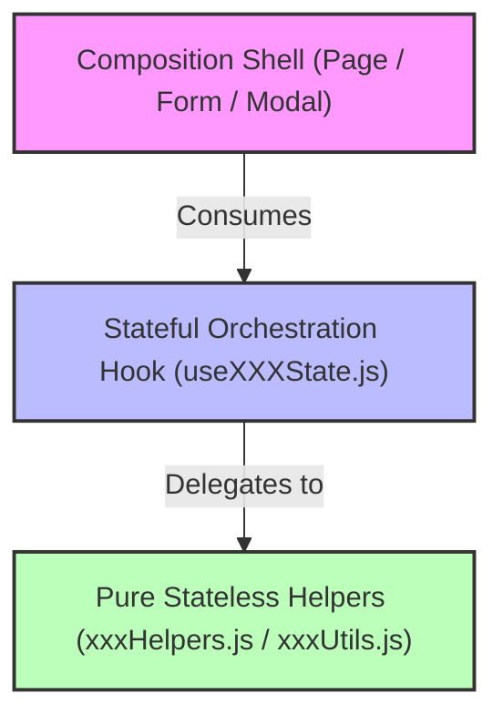

# Frontend Maintainability Refactoring Playbook

This document serves as the official architectural standard and operational playbook for refactoring oversized React files in this repository. All subsequent engineering agents and developers must strictly adhere to these patterns and guardrails to ensure consistent quality, high code readability, and zero regression of system behaviors.

---

## 1. Architectural Vision: The Three-Tier Separation Pattern

To ensure high readability and maintainability, our system utilizes a **Three-Tier Separation Pattern** for all components, pages, forms, and modals. This separates layout structure, state workflow, and business validation/calculation:



### 📋 Tier Definition & Responsibilities

| Tier | File Naming | Core Responsibility | Permitted Elements |
|---|---|---|---|
| **1. Composition Shell** | `MyComponent.jsx` | Renders layouts, structural templates, styling wrappers, and routes. | JSX, UI subcomponents, destructured properties from its custom hook. **Zero custom state declarations, raw handlers, or effects.** |
| **2. Stateful Hook** | `useMyComponentState.js` | Coordinates data fetching, manages React state flags, triggers side-effects, and orchestrates callbacks. | `useState`, `useEffect`, `useMemo`, `useLanguage`, API triggers, validation runners. |
| **3. Stateless Helper** | `myComponentHelpers.js` | Executes complex calculations, string formatting, list filters, form validations, and draft payload builds. | Pure JS functions. **Zero React imports, zero states, zero hooks, and zero side effects.** |

> [!IMPORTANT]
> **Primary Rule of Refactoring**: Low-risk extraction is always preferred over broad rewrites. Do not change visual layout borders, spacing styles, or network integration behaviors during a maintainability refactor.

---

## 2. Refactoring Workflow: Step-by-Step

Follow this systematic step-by-step approach when addressing any remaining oversized target in the codebase:

### Phase 1: Analysis & Scoping
1. Open the monolithic file and map out the state variables (`useState`), side-effects (`useEffect`), and internal handlers.
2. Locate contiguous blocks of business calculations, form validators, or list transformers that do not rely directly on React state setter functions.

### Phase 2: Extracting Pure Logic
1. Create a `xxxHelpers.js` or `xxxUtils.js` module in the same component folder.
2. Move pure logic functions (e.g. calculation of totals, date format helpers, validation payload checks) into the new file.
3. Write clean, descriptive JSDoc block comments explaining non-obvious rules.
4. Export these functions explicitly.

### Phase 3: Building the Orchestration Hook
1. Create `useXXXState.js` in the component directory.
2. Move all React state variables, `useLanguage()`, custom API hooks, and `useEffect` actions into the hook.
3. Replace inline state mutation blocks inside event handlers with delegation calls to the helper functions (passing the draft state as an argument and returning the next state).
4. Return a structured flat object containing states, formatted view metrics, and action callbacks.

### Phase 4: Compacting the Composition Shell
1. Import the custom state hook inside the main file `MyComponent.jsx`.
2. Invoke the hook at the top level and destructure the required properties.
3. Bind form triggers and input values directly to the destructured state properties and callbacks.
4. Clean up unused imports at the top of the file.

---

## 3. Strict Scope & Guardrails

> [!WARNING]
> Refactoring must be highly surgical. Do not mix stylistic modifications, layout rewrites, or framework upgrades into maintainability refactoring tasks.

- **Workflows Preservation**: Keep existing creation, editing, deletion, state status toggling, and page navigation flows completely intact.
- **Bilingual Context Requirements**: Every user-facing UI text string must be retrieved via the internationalization hook `t()` and present in both language dictionary arrays (`en` and `th`) inside `frontend/src/i18n/translations.js`.
- **Validation Authority**: Ensure that client-side validations (e.g. SKU locks, required flags, email checks) accurately mirror the constraints documented in `contactValidation.js` or the backend API.
- **Relational Fallbacks**: Never break fallback systems designed for mock data or missing relational connections.
- **Compact UI Spacing**: Keep styling aligned with the square compact layout design system (borders, 4px card borders, dense spacing grids).

---

## 4. Quality Verification Standards

Proactively execute the verification suite after completing a refactor of any component:

```bash
# 1. Compile the production bundle using Vite (MUST return zero warnings or compilation errors)
cd frontend
npm run build

# 2. Audit dependencies for security issues
npm audit --audit-level=moderate
```

---

## 5. Architectural Map: Completed Refactors

Below is a master reference log of all refactored pages, forms, and modals completed inside the repository:

### 🌟 Core Pages & Orchestration
- **[App.jsx](file:///Users/peto/Documents/Inventory-Management-frontend/frontend/src/App.jsx)** (392 → 124 lines)
  - Completely reduced to a layout composition shell.
  - State orchestration, sync effects, warning mechanisms, and custom hooks consolidated in **[useAppState.js](file:///Users/peto/Documents/Inventory-Management-frontend/frontend/src/app/useAppState.js)**.
- **[ProductsPage.jsx](file:///Users/peto/Documents/Inventory-Management-frontend/frontend/src/components/ProductsPage.jsx)** (518 → 133 lines)
  - Decomposed into a layout orchestrator.
  - State workflow and validations extracted to **[useProductsPageState.js](file:///Users/peto/Documents/Inventory-Management-frontend/frontend/src/components/products/useProductsPageState.js)** and **[productsPageHelpers.js](file:///Users/peto/Documents/Inventory-Management-frontend/frontend/src/components/products/productsPageHelpers.js)**.
- **[PurchaseHistoryPage.jsx](file:///Users/peto/Documents/Inventory-Management-frontend/frontend/src/components/PurchaseHistoryPage.jsx)** (362 → 117 lines)
  - Filter matrices, presets, active chips, and pagination extracted to **[usePurchaseHistoryPageState.js](file:///Users/peto/Documents/Inventory-Management-frontend/frontend/src/components/purchases/usePurchaseHistoryPageState.js)**.

### 💼 Master Directories (Pages, Forms, and Modals)
- **Category, Customer, & Supplier Pages**
  - Page states and filtering helpers decomposed into custom page state hooks and separate filter helpers.
- **Supplier & Customer Editor Modals**
  - Consolidated duplicate custom dropdown lists into **[ContactOptionField.jsx](file:///Users/peto/Documents/Inventory-Management-frontend/frontend/src/components/ContactOptionField.jsx)**.
  - Extracted nested form layouts into highly focused section subcomponents. Modals reduced to thin composition wrappers (< 110 lines).

### 🧾 Transactional Modals & Utilities
- **[BillingNoteDetailModal.jsx](file:///Users/peto/Documents/Inventory-Management-frontend/frontend/src/components/billing/BillingNoteDetailModal.jsx)** (413 → 332 lines)
  - Details state and modal triggers moved to **[useBillingNoteDetailState.js](file:///Users/peto/Documents/Inventory-Management-frontend/frontend/src/components/billing/useBillingNoteDetailState.js)**.
  - Line mutation state transformations moved to pure transformations in **[billingNoteDetailHelpers.js](file:///Users/peto/Documents/Inventory-Management-frontend/frontend/src/components/billing/billingNoteDetailHelpers.js)**.
- **[PaymentBatchDetailModal.jsx](file:///Users/peto/Documents/Inventory-Management-frontend/frontend/src/components/payments/PaymentBatchDetailModal.jsx)** (346 → 267 lines)
  - Details and lines marking workflow moved to **[usePaymentBatchDetailState.js](file:///Users/peto/Documents/Inventory-Management-frontend/frontend/src/components/payments/usePaymentBatchDetailState.js)**.
  - State transformation helpers extracted to **[paymentBatchDetailHelpers.js](file:///Users/peto/Documents/Inventory-Management-frontend/frontend/src/components/payments/paymentBatchDetailHelpers.js)**.

---

## 6. Current Refactor Targets & Focus Areas

### 🎯 Next Target: `frontend/src/components/Dashboard.jsx` (367 lines)

#### Recommended Refactor Approach:
- **State & Data Extraction**: Move dashboard API fetches, loading flags, filter dates, and summary computations into a custom state hook `useDashboardState.js`.
- **Chart Configuration**: Move chart configurations, metric aggregations, and formatting transforms into a pure helper `dashboardHelpers.js`.
- **Composition Layout**: Keep `Dashboard.jsx` as a structural grid of dashboard cards and visual charts.
