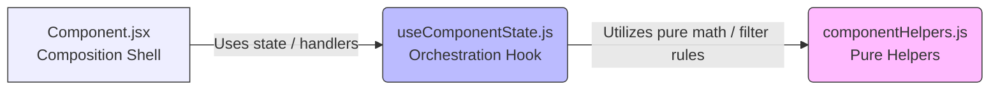

# 🎨 Frontend Architecture & Maintainability Guidelines

<p align="left">
  
  
  
  
</p>

This document serves as the permanent, authoritative architectural baseline and guidelines for maintaining and extending the frontend of **Bridge Inventory**. 

The goal is to keep the inventory system stable, predictable, and clean as new features arrive. We achieve this by reducing file complexity, enforcing clear separation of concerns, and preventing hooks or components from becoming monolithic.

---

## 1. Core Architectural Baseline

The frontend is built on a modular, decoupled architecture rather than large, monolithic page files. Every primary view or modal is split into three distinct, single-responsibility files:



*   **Thin Composition Shells**: Keep rendering markup clean and delegate all state management, effects, and actions.
*   **Orchestration Hooks**: Custom React hooks focused on owning component state, coordinating async API requests, and exposing view-ready structures.
*   **Pure Helper Modules**: Standard Javascript files responsible for calculations, formatters, and payload structures. They contain absolutely no React code or state.

---

## 2. Refactor Objectives

> [!TIP]
> **Every frontend modification or refactor should aim to improve at least one of these goals:**
> *   **Decompress Monoliths**: Reduce file sizes and cognitive load in large hooks or components.
> *   **Separate Concerns**: Isolate presentational rendering from asynchronous backend API calls.
> *   **Isolate Business Logic**: Move formulas, averages, and status filters into clean, named helper files.
> *   **Avoid Duplication**: Standardize repeated form logic or transaction details across folders.

---

## 3. Non-Negotiable Guardrails

> [!WARNING]
> **To maintain stable system behavior, developers must adhere to these guardrails:**
> *   **Preserve Workflows**: Never alter active purchase, sales, quotation, or finance statuses and calculations unless the ticket explicitly requires a behavior rewrite.
> *   **Backend is Authoritative**: Frontend checks exist purely to aid user experience. Stock sufficiency, document eligibility, and transaction transitions are strictly validated backend-side.
> *   **Keep mock-data fallbacks intact**: Do not remove offline/mock-data fallback systems casually. They support frontend-only demo deployments.
>   **Maintain i18n support**: All user-facing labels must be registered in the Thai and English sections of `frontend/src/i18n/translations.js` and rendered via the `t()` helper.
> *   **Adhere to UI Standards**: Keep the square, compact system UI (4px border-radius, constrained border outlines, tight spacing) intact. No oversized decorative or card marketing sections are allowed.

---

## 4. The Three-Part Decomposed Shape

When expanding pages, split components using this exact structured pattern:

### 4.1 The Composition Shell (`Component.jsx`)
*   **Responsibilities**:
    *   Render visual layout, structural HTML, and compact CSS classes.
    *   Pass simple properties down to child section components.
    *   Consume your custom state hook.
*   **Avoid**:
    *   Complex asynchronous fetch triggers.
    *   Direct data manipulation or formatting operations.
    *   Large inline calculation chains.

### 4.2 The Orchestration Hook (`useComponentState.js`)
*   **Responsibilities**:
    *   Manage component-specific React states, refs, and effects.
    *   Orchestrate and coordinate backend API requests via the `api` module.
    *   Expose structured, UI-ready states and handlers to the Shell.
*   **Avoid**:
    *   Returning large, loosely grouped variables (prefer returning focused, named sub-objects).
    *   Embedding JSX code fragments inside the hook.
    *   Burying pure math formulas or data formatting.

### 4.3 Pure Helper Modules (`componentHelpers.js`)
*   **Responsibilities**:
    *   Compute totals, taxes, and conversions.
    *   Format timestamps, currencies, or text labels.
    *   Structure payloads or validate fields.
*   **Rules**:
    *   **No React imports** (`useState`, `useEffect`, etc.).
    *   **Strictly Pure Functions**: No side-effects, browser window mutation, or global state variables.

---

## 5. Refactor Priority Backlog

Keep components highly modular. Focus refactoring efforts on these priority areas:

### Priority 1: High-Complexity Orchestration Hooks
Several orchestration hooks are currently acting as central logic hubs, risking becoming monoliths:
*   `frontend/src/app/useAppState.js`
*   `frontend/src/components/sales/useSalesFormState.js` / `useSalesEditFormState.js`
*   `frontend/src/components/purchases/usePurchaseFormState.js` / `usePurchaseEditFormState.js`
*   `frontend/src/components/quotation/useQuotationFormState.js`

*   **Direction**: Extract repeated line-item calculations, draft builders, and status check matrices into local helper modules. Maintain hooks strictly as workflow coordinators.

### Priority 2: Complex Section and Directory Components
Table rows and directories are likely to accumulate UI conditions and conditional styling over time:
*   `frontend/src/components/transactions/TransactionDetailItemsSection.jsx`
*   `frontend/src/components/quotation/QuotationDirectorySection.jsx`
*   `frontend/src/components/sales/SalesLineItemsSection.jsx`
*   `frontend/src/components/payments/CreatePaymentBatchModal.jsx`

*   **Direction**: Extract row renderers, action bars, or filter groups only when files exceed readability limits. Avoid premature extraction if files remain small and coherent.

---

## 6. Standard Refactor Workflow

```text
Step 1: Inspect ➔ Map responsibilities, note translations and mock dependencies.
Step 2: Isolate ➔ Extract pure math/filters into a dedicated helper module first.
Step 3: Hook    ➔ Move states, effects, and API triggers into a custom state hook.
Step 4: Shell   ➔ Clean up the component, removing dead imports, variables, and handlers.
Step 5: Verify  ➔ Run complete verification checks and build tests.
```

---

## 7. Refactor Acceptance Criteria

> [!IMPORTANT]
> **A refactor pull-request is acceptable only if all of the following are checked off:**
> - [ ] **No Behavior Churn**: Document status, FIFO layers, and transaction logic work identically.
> - [ ] **Localization Intact**: Bilingual translations switch correctly through `t()`.
> - [ ] **Mock Fallbacks Work**: Offline preview datasets load cleanly when base API URL is unset.
> - [ ] **Simplicity Achieved**: Target code files are simpler, cleanly bound, and easier to read.
> - [ ] **Clean Verification**: All Django checks, unit tests, and production build checks pass.

---

## 8. Verification Checks

Run the verification suite before committing any refactored code:

```bash
# 1. Backend Verification
backend/.venv/bin/python backend/manage.py check
backend/.venv/bin/python backend/manage.py makemigrations --check --dry-run
backend/.venv/bin/python backend/manage.py test inventory

# 2. Frontend Production Build Check
cd frontend
npm run build
npm audit --audit-level=moderate
```
