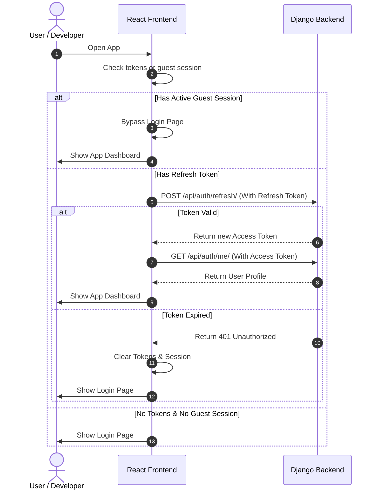

# Bridge Inventory — Authentication & Login System

This document explains the architecture, endpoints, and flow of the Django + React JWT login system implemented in Bridge Inventory.

---

## 1. Overview & Business Model

Bridge Inventory is built for small-to-medium enterprise (SME) middleman businesses (e.g., family-owned reselling businesses). Because of this:
- **No Self-Registration**: There is no public signup or registration page. Only the business owner (admin/superuser) can create accounts or assign permissions via the Django Admin panel.
- **Guest Mode Bypass**: To allow developer velocity during coding and review without needing credentials, a **"Continue as Guest"** option is integrated.
- **Autoritative Backend Validation**: Setting the environment variable `INVENTORY_REQUIRE_AUTH=True` enforces login across all REST API endpoints. When `False` (default for development), endpoints default to `AllowAny`, and Guest mode is fully supported.

---

## 2. Architecture & Flow



---

## 3. Backend Implementation

### A. Dependencies
Added `djangorestframework-simplejwt` to handle JSON Web Tokens (JWT).

### B. Configuration (`backend/config/settings.py`)
- Registered `"rest_framework_simplejwt"` in `INSTALLED_APPS`.
- Configured Simple JWT defaults:
  - **Access Token Lifetime**: 30 minutes (kept relatively short for security).
  - **Refresh Token Lifetime**: 7 days.
  - **Authentication Header**: `Bearer <token>`.
- Configured `REST_FRAMEWORK` default authentication and permissions:
  ```python
  REST_FRAMEWORK = {
      ...
      "DEFAULT_PERMISSION_CLASSES": [
          "rest_framework.permissions.IsAuthenticated"
          if INVENTORY_REQUIRE_AUTH
          else "rest_framework.permissions.AllowAny"
      ],
      "DEFAULT_AUTHENTICATION_CLASSES": [
          "rest_framework_simplejwt.authentication.JWTAuthentication",
      ],
  }
  ```

### C. Authentication Endpoints
All authentication URLs are managed in `backend/config/urls.py`:
- `POST /api/auth/login/` (Simple JWT default): Validates credentials and returns an `access` and `refresh` token pair.
- `POST /api/auth/refresh/` (Simple JWT default): Accepts a valid `refresh` token and returns a fresh `access` token.
- `GET /api/auth/me/` (Custom endpoint in `backend/inventory/auth_views.py`): Returns active user info:
  ```json
  {
    "id": 1,
    "username": "admin",
    "email": "admin@example.com",
    "is_staff": true,
    "is_superuser": true
  }
  ```

---

## 4. Frontend Implementation

### A. State Provider (`frontend/src/auth/AuthContext.jsx`)
Exposes the session states and credentials functions:
- `user`: Object containing active user details (`{ username, email, is_superuser, ... }`) or `null`.
- `isGuest`: `true` if bypass mode is selected.
- `isAuthenticated`: `true` if logged in via JWT.
- `login(username, password, rememberMe)`: Performs credentials post-back, saves tokens, and loads user profile.
- `logout()`: Clears all tokens, guest keys, and resets state.
- `continueAsGuest()`: Commits a transient guest bypass flag.

### B. Token Storage & "Remember Me"
- **Remember Me Checked**: Tokens are stored in `localStorage` (persists indefinitely across browser restarts).
- **Remember Me Unchecked**: Tokens are stored in `sessionStorage` (cleared instantly when the browser tab is closed).
- **Guest Mode Session**: Guest mode is tracked via `sessionStorage.getItem("inventory_is_guest")`, meaning opening a new tab or restarting the browser prompts the login page again.

### C. HTTP Request Interceptor (`frontend/src/api.js`)
All API calls using `request()` automatically handle JWT headers and silent token renewals:

1. **Authorization Headers**:
   When an access token exists in storage, the interceptor automatically appends:
   `Authorization: Bearer <token>`
   
2. **Silent Background Token Refresh (401 Interceptor)**:
   If a request encounters a `401 Unauthorized` status code, the client checks if a `refresh` token is available.
   - If a refresh token is present, it suspends the original request, fetches a new `access` token from `/api/auth/refresh/`, updates storage, and transparently retries the original request with the new header.
   - If the refresh token is expired or the refresh endpoint rejects, it triggers a custom `"auth-expired"` event which signals `AuthContext` to instantly wipe the local state and return to the login interface.

---

## 5. Bilingual Support (i18n)

All elements on the Login page are translated. Strings are keyed inside `frontend/src/i18n/translations.js` under `login.*` and rendered via the `t()` helper. Language switching can be executed directly from the footer of the login card.

---

## 6. How to Configure & Run

### A. Enforcing Authenticated Requests (Production/Staging)
By default, the backend operates in open/development mode. To enforce authentication rules globally:
1. Open the backend environment file (`backend/.env`).
2. Add or update the variable:
   ```env
   INVENTORY_REQUIRE_AUTH=True
   ```
3. Restart your Django development server. All API endpoints will now reject requests lacking a valid Bearer token.

### B. Creating Accounts (Staff/Owners)
Use the standard Django Admin CLI:
```bash
backend/.venv/bin/python backend/manage.py createsuperuser
```
Follow the prompts to enter a username, email, and password. This account can then log in via [http://localhost:5173/](http://localhost:5173/).

### C. Running Verification Tests
Ensure the authentication and authorization middleware runs correctly:
```bash
# Run backend tests
backend/.venv/bin/python backend/manage.py test inventory

# Run frontend build checks
cd frontend && npm run build
```
